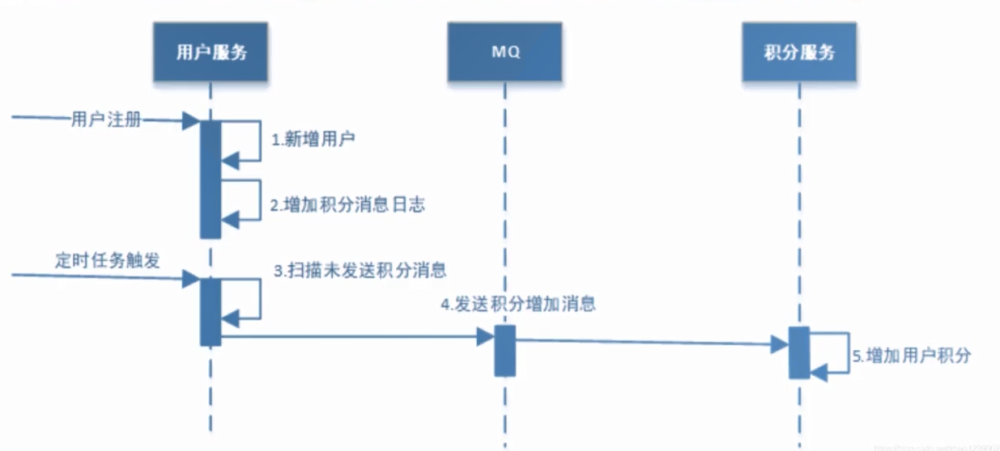
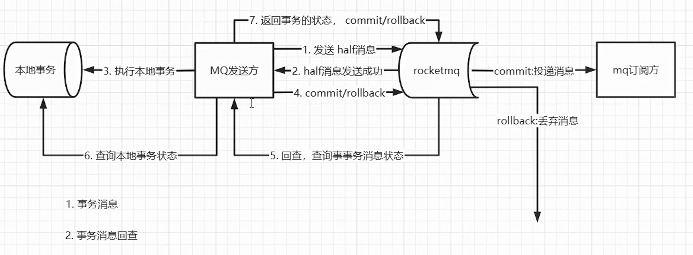
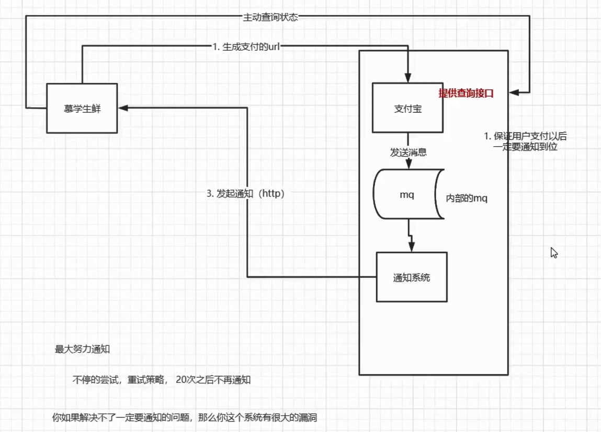

## 互联网发展背景

单体->垂直->分布式->SOA->微服务

微服务架构带来数据一致性问题

## 理论与模型

CAP理论、BASE理论

**强一致性分布式事务模型**：DTP、2PC、3PC、XA

**最终一致性分布式事务模型**：TCC、可靠消息最终一致性、最大努力通知、基于本地消息表实现最终一致性

# 事务的类型与特性

## 事务的特性

- 原子性
- 一致性
- 隔离性
- 持久性

## 事务的类型

- 扁平事务

  > 扁平事务是涉及事务操作中最常见，也是最简单和最常用的一种事务。在数据库中，其通常使用begin或者start transaction字段开始，由 commit或者 rollback 字段结束。在这之间的所有操作要么全部提交成功，要么全部提交失败（回滚）。当今主流的数据库几乎都支持扁平事务的实现。

  __缺点__: 无法提交或回滚整个事务中的部分事务，只能把整个事务全部提交或回滚。

- 带有保存点的扁平事务

  > 扁平事务如果在事务内部设置了保存点，就是带有保存点的扁平事务。
  >
  > 带有保存点的扁平事务通过在事务内部的某个位置设置savepoint，来达到将当前事务回滚到此位置的目的

  ​    普通的扁平事务其实是一种特殊的带有保存点的扁平事务，保存点在事务的开始未知

- 链式事务

  > 链式事务是在带有保存点的事务的基础上,自动将当前事务的上下文隐式地传递给下一个事务。
  >
  > 也就是说，一个事务的提交操作和下一个事务的开始操作具备原子性，上一个事务的处理结果对下一个事务是可见的。事务与事务之间就像链条一样传递下去。

  ​    链式事务在提交的时候会释放掉要提交事务中的所有锁和所有保存点，链式事务的回滚操作只能回滚到当前所在事务的保存点，不能回滚到已提交事务的保存点。

- 嵌套事务

  > 嵌套事务就是有多个事务处于嵌套状态，共同完成一项任务的处理，整个任务具备原子性。
  >
  > 嵌套事务最外层有一个顶层事务，这个顶层事务控制着所有的内部子事务，内部子事务提交完成后，整体事务并不会提交，只有等到最外层的顶层事务提交完成后，整体事务才算提交完成。

  1. 回滚嵌套事务内部的子事务时，会将事务回滚到外部顶层事务的开始位置
  2. 提交是从内部的子事务向外依次提交，直到最外层的顶层事务提交完成
  3. 回滚最外层的顶层事务时，会回滚嵌套事务中包含的所有事务，包括已提交的内部事务

- 分布式事务

  > 分布式事务指的是事务的参与者、事务的管理器、涉及的资源服务器以及事务协调器等分别位于不同的分布式系统的不同服务或数据库的节点上。


# 常见的分布式事务解决方案

## 两阶段提交(2PC)

两阶段提交又称**2PC**，2PC是一个非常经典的`中心化的原子提交协议`。

这里所说的中心化是指协议中有两类节点:一个是中心化`协调者节点`(coordinator)和`N个参与者节点`(partcipant)。
`两个阶段`：第—阶段：**准备阶段** 和 第二阶段：**提交/执行阶段**。

例如**订单服务A**，需要调用**支付服务B**去支付，支付成功则处理购物订单为待发货状态，否则就需要将购物订单处理为失败状态。

### 第一阶段（准备阶段）

1）事务询问

协调者向所有参与者发送事务预处理请求（Prepare），并开始等待各参与者的响应。

2）执行本地事务

各个参与者节点执行本地事务操作，在执行完成后不会真正提交数据库本地事务，而是先向协调者报告说是否可以处理。

3）各参与者向协调者反馈事务询问的响应。

如果参与者成功执行了事务操作，那么就反馈给协调者Yes响应，表示事务可以执行，如果没有参与者成功执行事务，那么就反馈给协调者No响应，表示事务不可以执行。

第一阶段执行完后，要么所有参与者都返回Yes，要么有一个或多个返回No。

### 第二阶段（提交/执行阶段）

如果所有参与者给协调者的信息都是Yes，那么就会执行事务提交。

1）事务提交

**协调者** 向所有参与者节点发出Commit请求。

2）执行

**参与者** 收到Commit请求后，正式执行本地 事务Commit操作，并在完成提交之后释放整个事务执行期间占用的事务资源。

有一个或多个参与者给协调者返回No，就会进行异常流程。

1）发送回滚请求

**协调者** 向所有参与者节点发出Rollback请求

2）事务回滚

**参与者** 接收到Rollback请求后，会回滚本地事务。

### 2PC缺点

1)**性能问题**

无论是在第一阶段的过程中，还是在第二阶段，所有的**参与者资源和协调者资源都是被锁住**的，只有当所有节点准备完毕，事务协调者才会通知进行全局提交，**参与者** 进行本地事务提交后才会释放资源。这样的**过程会比较漫长，对性能影响比较大**。

2)**单节点故障**
由于 **协调者** 的重要性，一旦 **协调者** 发生故障。**参与者 **会一直阻塞下去。尤其在第二阶段，**协调者 **发生故障，那么所有的参与者还都处于锁定事务资源的状态中，而无法继续完成事务操作。(虽然协调者挂掉，可以重新选举一个协调者，但是无法解决因为协调者宕机导致的参与者处于阻塞状态的问题)

## TCC分布式事务

首先需要选择某种TCC分布式事务框架，各个服务里就会有这个TCC分布式事务框架在运行。

然后原本的一个接口，要改造为3个逻辑，Try-Confirm-Cancel。

先是服务调用链路依次执行Try逻辑

如果都正常的话，TCC分布式事务框架推进执行Confirm逻辑，完成整个事务

如果某个服务的Try逻辑有问题，TCC分布式事务框架感知到之后就会推进执行各个服务的Cancel逻辑，撤销之前执行的各种操作。

这就是所谓的TCC分布式事务。

TCC分布式事务的核心思想，就是当遇到下面这些情况时

- 某个服务的数据库宕机了
- 某个服务自己挂了
- 服务的redis、elasticsearch、MQ等基础设施故障了
- 某些资源不足了，比如说库存不够这些

先Try一下，不要把业务逻辑完成，先试试看，看各个服务能不能基本正常运转，能不能先冻结需要的资源。如果Try都ok，也就是说，底层的数据库、redis、elasticsearch、MQ都是可以写入数据的，并且你保留好了需要使用的一些资源(比如冻结了一部分库存)

接着，再执行各个服务的Confirm逻辑，基本上Confirm就可以很大概率保证一个分布式事务的完成了。·那如果Try阶段某个服务就失败了，比如说底层的数据库挂了，或者redis挂了，等等。

此时就自动执行各个服务的Cancel逻辑，把之前的Try逻辑都回滚，所有服务都不要执行任何设计的业务逻辑。保证大家要么一起成功，要么一起失败。

### 异常状况处理

**Q：** 如果有一些意外的情况发生了，比如说订单服务突然挂了，然后再次重启，TCC分布式事务框架是如何保证之前没执行完的分布式事务继续执行的呢?

**A：** TCC事务框架要记录一些分布式事务的活动日志，可以在磁盘上的日志文件里记录，也可以在数据库里记录。保存下来分布式事务运行的各个阶段和状态。


**Q：** 某个服务的Cancel或者Confirm逻辑执行一直失败怎么办?

**A：** TCC事务框架会通过活动日志记录各个服务的状态。

例如，比如发现某个服务的Cancel或者Confirm一直没成功，会不停的重试调用他的Cancel或者Confirm逻。
辑，务必要他成功！

当然了，如果你的代码没有写什么bug，有充足的测试，而且Try阶段都基本尝试了一下，那么其实一般Confirm、Cancel都是可以成功的！

如果实在解决不了，那么这个一定是很小概率的事件，这个时候发邮件通知人工处理。

### 优缺点

**优点:**

1. 解决了跨服务的业务操作原子性问题，例如组合支付，订单减库存等场景非常实用
2. TCC的本质原理是把数据库的二阶段提交上升到微服务来实现，从而避免了数据库2阶段中锁冲突的长事务低性能风险。
3. TCC异步高性能，它采用了try先检查，然后异步实现confirm，真正提交的是在confirm方法中:

**缺点:**

1. 对微服务的侵入性强，微服务的每个事务都必须实现try，confirm，cancel等3个方法，开发成本高，今后维护改造的成本也高。
2. 为了达到事务的一致性要求，try，confirm、cancel接口必须实现等幂性操作。(定时器+重试)
3. 由于事务管理器要记录事务日志，必定会损耗一定的性能，并使得整个TCC事务时间拉长，建议采用redis的方式来记录事务日志。
4. tcc需要通过锁来确保数据的一致性，会加锁导致性能不高

## 基于本地消息表的最终一致性

本地消息表这个方案最早由eBay提出，此方案的核心是通过本地事务保证数据业务操作和消息的一致性，然后通过定时任务将消息发送至消息中间件，待确认消息发送给消费方，成功再将消息删除。

如果上游服务直接将消息发送到mq，下游服务订阅mq，那么有两种情况：

1）先记录，再发送mq

记录成功后服务突然宕机，那么发送mq的操作就失败了，如果是正常的业务失败，那么会返回失败；宕机就没有办法处理。

2）先发mq，再记录

网络抖动，上游服务发送消息到mq超时，回滚业务，然而mq实际上接收到了任务并进行了处理，导致数据不一致。

### 交互流程



**1、用户注册**
用户服务在本地事务新增用户和增加“积分消息日志”。(用户表和消息表通过本地事务保证一致)

下表是伪代码

```sql
begin transaction;
-- 1.新增用户
-- 2.存储积分消息日志
commit transaction;
```

这种情况下，本地数据库操作与存储积分消息日志处于同一事务中，本地数据库操作与记录消息日志操作具备原子
性。

**2、定时任务扫描日志**
如何保证将消息发送给消息队列呢?
经过第一步消息已经写到消息日志表中，可以启动独立的线程，定时对消息日志表中的消息进行扫描并发送至消息中间件，在消息中间件反馈发送成功后删除该消息日志，否则等待定时任务下一周期重试，

**3、消费消息**
如何保证消费者一定能消费到消息呢?
这里可以使用 MQ 的 ack (即消息确认)机制，消费者监听 MQ，如果消费者接收到消息并日业务处理完成后向 MQ 发送 ack (即消息确认)，此时说明消费者正常消费消息完成，MQ将不再向消费者推送消息，否则消费者会不断重试向消费者来发送消息。
积分服务接收到“增加积分”消息，开始增加积分，积分增加成功后消息中间件回应ack，否则消息中间件将重复投递此消息。
由于消息会重复投递，积分服务的“增加积分”功能需要实现幂等性。

### 总结

上述的方式是一种非常经典的实现，基本避免了分布式事务，实现了“最终一致性”。但是，关系型数据库的吞吐量和性能方面存在瓶颈，频繁的读写消息会给数据库造成压力。所以，在真正的高并发场景下，该方案也会有瓶颈和限制的。

## 基于可靠消息（事务消息）的最终一致性

 

即使网络抖动，rocketmq此时保存的只是 half Message ，不会真正执行。rocketmq会定期回查，向发送方询问到底应该要 commit 还是 rollback，这样就保证了消息是可靠的。

## 最大努力通知方案



这个业务场景是，如果用户支付了，一定要通知商户

特殊情况是，第三方接入方可能存在：1）没有接收通知的接口 2）接收通知的接口异常 3）服务不可用

无论哪种情况，接入方一定要能够获取到通知。


那么，首先要有重试策略，指数减少和通知上限保证不会无止境地增加服务和网络负担。

而且用户在修复好系统后也应当能够获取通知，所以要提供查询的接口。

支付系统业务服务同时负责通知也会有性能压力，所以要用mq解耦。给第三方提供服务的mq不能像基于可靠消息的最终一致性的那种方式让用户自己拉取，因为暴露在公网不安全。只能让通知系统主动发起通知。
